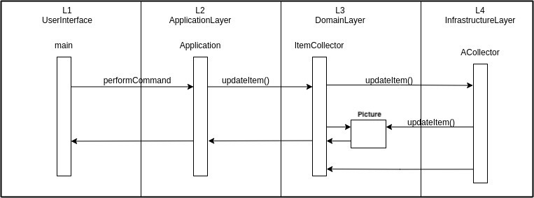

Министерство науки и высшего образования Российской Федерации  
Федеральное государственное бюджетное образовательное учреждение  
высшего образования  
«Московский государственный технический университет  
имени Н.Э. Баумана  
(национальный исследовательский университет)»  
(МГТУ им. Н.Э. Баумана)

ФАКУЛЬТЕТ ИНФОРМАТИКА И СИСТЕМЫ УПРАВЛЕНИЯ  
КАФЕДРА КОМПЬЮТЕРНЫЕ СИСТЕМЫ И СЕТИ (ИУ6)

 

ОТЧЕТ  
к лабораторной работе №1  
по дисциплине "Современные технологии разработки  
программного обеспечения"  
Реализация приложения в многоуровневой архитектуре  
с использованием удалённого репозитория кода

 

Преподаватель: Фетисов М.В.

Студент группы ИУ6-22м Гудзенко Артем Валерьевич.

## Описание задания

Задача № 5: «Картинная галерея».
Карточка Picture должна содержать следующие данные:
- наименование картины,
- автор,
- год создания,
- живописная техника (масло, графика, другое).

Вариант задания № 5: Постройте диаграмму последовательности выполнения команды <strong> update</strong>. Диаграмма должна показывать прохождение выполнения команды между программными объектами, расположенными в соответствующих слоях многоуровневой архитектуры.

## Адрес проекта

Проект хранится в удаленном репозитории по адресу: [https://bmstu.codes/msdtm/iu6-2022/iu6-22m-avgudzenko/laba-1](https://bmstu.codes/msdtm/iu6-2022/iu6-22m-avgudzenko/laba-1).

## Документация 

Диаграммы классов создаются автоматически при обновлении ветки `master` в удаленном репозитории GitLab и выкладываются в страницы проекта по адресу: [https://msdtm.pages.bmstu.codes/iu6-2022/iu6-22m-avgudzenko/laba-1/files.html](https://msdtm.pages.bmstu.codes/iu6-2022/iu6-22m-avgudzenko/laba-1/files.html).

Отчёт о покрытии тестами создаётся автоматически при обновлении ветки `master` в удаленном репозитории GitLab и выкладываются в страницы проекта по адресу: [https://msdtm.pages.bmstu.codes/iu6-2022/iu6-22m-avgudzenko/laba-1/coverage/index.html](https://msdtm.pages.bmstu.codes/iu6-2022/iu6-22m-avgudzenko/laba-1/coverage/index.html).

## Диаграмма последовательности

Последовательность выполнения команды update:

## Выводы

В результате лабораторной работы были получены следующие навыки:
- Работа с системой контроля версий Git. (Добавление, изменение, удаление данных с сервера);
- Работа c промышленной методологией разработки проектов с DDD;
- Изучены концепции DDD по каждым отдельным уровням;
- Изучен процесс запуска системы покрытия тестов; 
